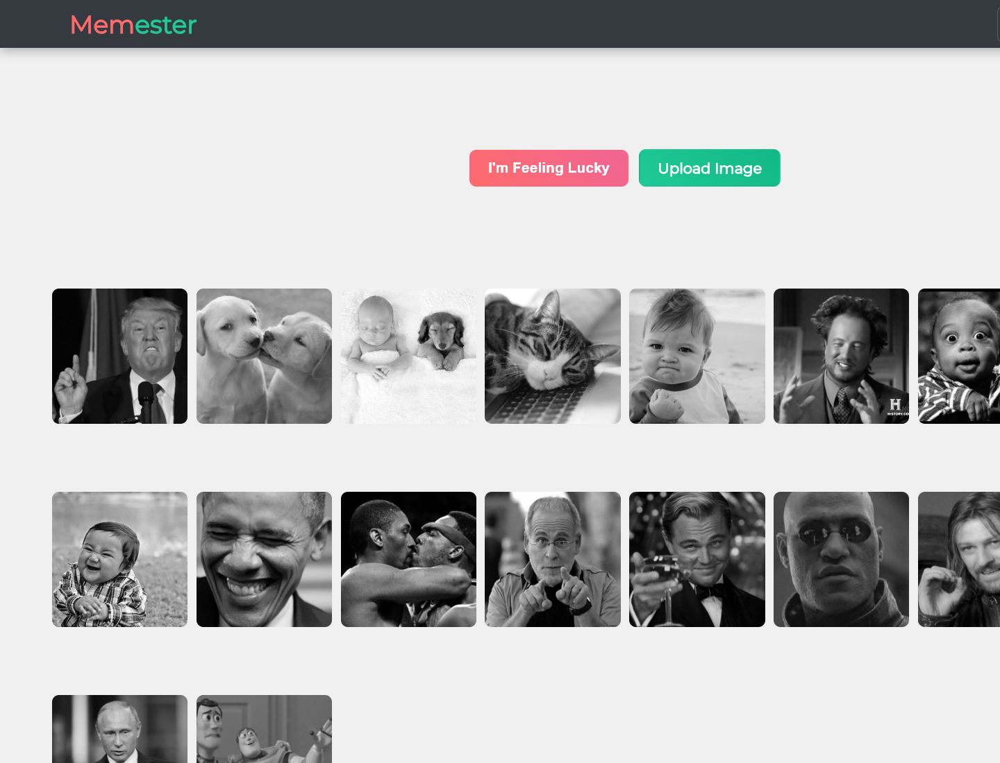
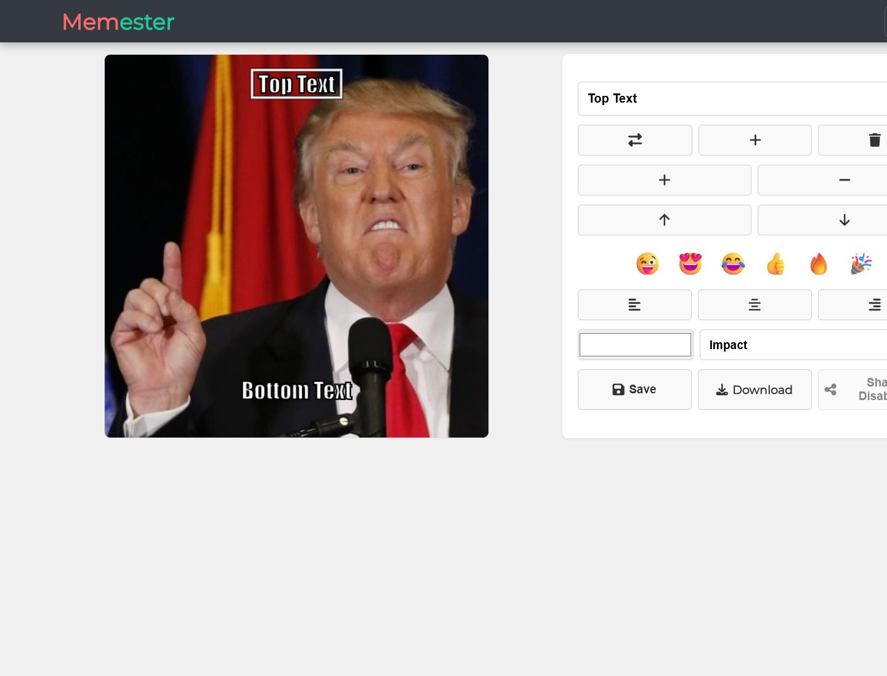

# Ultimate Meme Generator (Memester)

Client-side meme generator built with vanilla HTML, CSS, JavaScript, and Canvas.

[](https://aviad-benhamo.github.io/ca-meme-generator/)
[](LICENSE)
[](#project-status)

## Project Status
This repository is a dependency-free static web app originally built as a Coding Academy project and maintained as a public portfolio repository.

Current maturity:
- Stable for local use and public demo browsing
- No backend, database, or build pipeline
- Lightweight automated static validation plus manual browser validation

## Live Demo
Public GitHub Pages demo:

- https://aviad-benhamo.github.io/ca-meme-generator/

## Screenshots
Current application screenshots:

### Gallery View


### Editor View


## Features
- Browse a built-in gallery of meme images
- Upload your own image and edit it on the canvas
- Add multiple text lines with font, size, color, and alignment controls
- Add emoji stickers
- Select text or stickers directly from the canvas
- Save memes locally with `localStorage`
- Download finished memes as JPG files
- Keep public-demo sharing disabled until a restricted Cloudinary preset is explicitly reviewed

## Tech Stack
- HTML5
- CSS3
- Vanilla JavaScript
- Canvas API
- Browser `localStorage`
- Optional Cloudinary unsigned-upload integration for non-public or tightly restricted deployments

## Quick Start
Requirements:
- A modern browser such as Chrome, Firefox, Edge, or Safari
- JavaScript enabled

Run locally with no build step:

1. Open the project directory.
2. Open `index.html` directly in a browser, or serve the folder with a simple static server.

PowerShell examples:

```powershell
# Using Python 3
python -m http.server 8080

# Or using http-server from npm
npx http-server -c-1
```

Then open `http://localhost:8080`.

## Usage
1. Open the gallery and choose a built-in image, or upload your own image.
2. Add or edit text lines from the editor controls.
3. Change font, color, size, alignment, and vertical position.
4. Add emoji stickers and select items directly from the canvas.
5. Save the meme locally or download it as a JPG file.
6. In the public demo, use download instead of share because public client-side sharing is intentionally disabled.

## Configuration And Security Notes
This repository does not use `.env` files or a runtime configuration layer. All shipped behavior is client-side and visible in the source.

Cloudinary sharing notes:
- The public demo keeps direct client-side sharing disabled by default.
- If sharing is re-enabled in another environment, use only a tightly restricted unsigned Cloudinary preset.
- Restrict upload scope with isolated folders or naming rules, size and format limits, overwrite protection, and abuse-resistant preset settings.
- Never commit Cloudinary secrets, API keys, or private credentials.

Security references:
- See [SECURITY.md](SECURITY.md) for vulnerability reporting.
- See [LICENSE](LICENSE) for licensing terms.

## Project Structure
- `index.html` - Application entry point and main layout
- `css/` - Styles split into setup, basics, and components
- `js/` - Controllers, state services, and shared utilities
- `img/` - Gallery images and the optimized favicon asset
- `assets/screenshots/` - Public documentation screenshots for the README and repository presentation
- `fonts/` - Local editor font files

## Design Principles
- Keep the project dependency-free and easy to run locally
- Preserve a browser-only architecture with no backend coupling
- Favor simple DOM and Canvas flows over framework abstractions
- Keep public-demo behavior explicit, especially around uploads and sharing

## Development And Validation
Expected development workflow:

1. Make focused changes on a dedicated branch.
2. Verify the relevant user flow in a browser.
3. Run lightweight repository checks before review.

Useful validation steps for this repository:
- `npm run validate`
- `git diff --check`
- Launch a local static server and test the main flows manually
- Verify the GitHub Pages demo when documentation or metadata changes

## Testing And Quality Checks
This project does not currently include automated unit or integration tests.

Available lightweight static checks:
- `npm run validate` runs JavaScript syntax validation, confirms `index.html` exists, and verifies local asset references used by HTML, CSS, and JavaScript files.
- `.github/workflows/static-quality.yml` runs the same validation on pull requests and on pushes to `main`.

Current quality expectations:
- Static validation should pass before review
- Manual browser validation for gallery, editor, save, and download flows
- Documentation updates should keep links and setup instructions accurate
- Security-sensitive behavior such as public sharing must stay documented and intentionally scoped

## AI-Assisted Development
This repository may include AI-assisted documentation, maintenance, and implementation work. All generated changes should still be reviewed for correctness, clarity, and security before release.

## Roadmap
Near-term repository priorities:
- Improve documentation completeness and portfolio presentation
- Keep public sharing behavior safe and explicit
- Add clearer release-history and maintenance hygiene
- Consider future screenshot and demo-polish documentation updates

## Changelog
Project history and pending changes are tracked in [CHANGELOG.md](CHANGELOG.md).

## Release Policy
This project uses a lightweight, GRS-aligned release process for a static portfolio app.

Initial version decision:
- The initial release line is `v0.1.0`, not `v1.0.0`.
- This repository is public and usable, but it is still maintained as an early-stage Coding Academy and portfolio project rather than a declared stable product.
- Future release tags must follow the format `vMAJOR.MINOR.PATCH`.

Release checklist:
1. Confirm the relevant issue scope is complete and documented.
2. Keep pending work in the `[Unreleased]` section of `CHANGELOG.md`.
3. Run `npm run validate`.
4. Run `git diff --check`.
5. Manually verify the main browser flows and the GitHub Pages demo when relevant.
6. Choose the next version using Semantic Versioning.
7. Move the released entries from `[Unreleased]` into a dated version section only during release preparation.
8. Create the Git tag and GitHub Release only after release blockers are resolved and approval is given.

## License
This project is licensed under the [MIT License](LICENSE).
